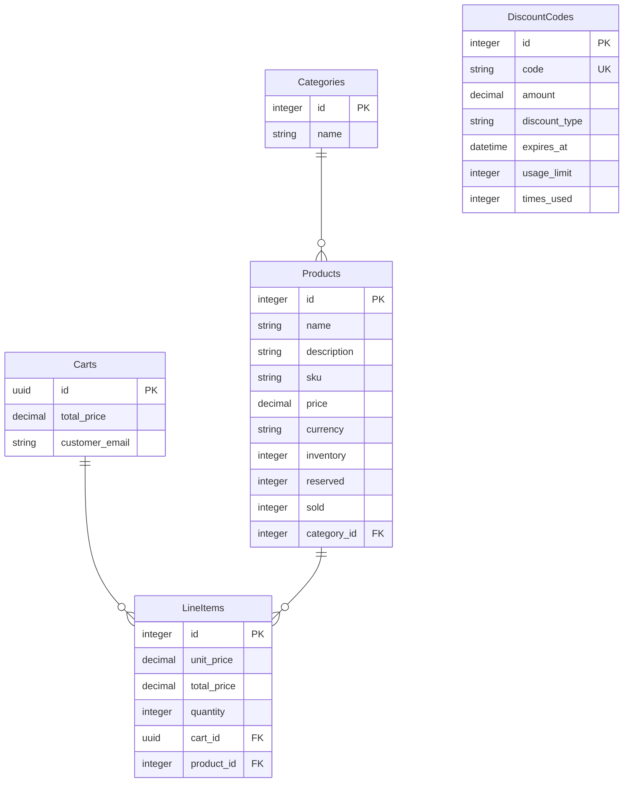

# Backend Evaluation 2024-02 - MinerPlace - Recognition

**MinerPlace** is a **store** for home supplies, where customers can select amoung the available products and receive them in the comfort of their homes.

## Given Scenario

This app is the heart of our product. It offers a set of endpoins that will be accessed from our store front.

Currently, we allow requests to retrieve products, categories and carts. The carts are persisted in the back-end, so all interactions from customers will be handled on this end.

Products can be agregated through Categories. Products are also directly associated to LineItems, which are used to compose a Cart.

Further details on the available endpoints and the current entities can be found down below.

## Requirements

- Ruby 3.2.2
- [Bundler](https://bundler.io/)
- [Docker](https://docs.docker.com/get-docker/) and [Docker Compose](https://docs.docker.com/compose/install/)

## Important Dependencies

- [Rails](https://github.com/rails/rails/)

## Setting up

- `bundle install` - Install all dependencies
- `docker compose up --build` - Run the database and all services needed
- `bundle exec rails db:setup` - Setup the database

## Running

For simplicity during development the database is configured to run in a Docker container. The application is not, and should be executed in the host computer.

In the root directory:

- `docker compose up` - Run the database

In the `./minerplace/` directory:

- `rails server` - Run the application

## Entities

> [!WARNING]
> !!! Some fields and entities pertaining to standard Rails operations are elided in the diagram above. !!!

## API

API documentation for the existing endpoints can be found in the `API.md` file.

**IMPORTANT: The API might fail due to network issues or other reasons, take that into consideration!**

## Critics to the original code

In addition to a Merge Request for each task, it's expected from you to write a document criticizing the original code provided, where you can mention things that you would change or refactor if it was a real client project. Use the setup and code exploration phase to pay attention to informations that you would add to this document.

The document should be provided in a file called critics.md in the Merge Request.

## Gitlab Instructions

- Create a new **private and empty** repository (leave "Initialize repository with a README" **unchecked**, like image below) in your own Gitlab account and give access to it to your reviewer:

- Clone **your** repository locally
- Inside the folder, run: `git pull https://gitlab.com/codeminer-42/avaliacoes/minerplace-rails main && git push origin main`.
